- Handshake là HTTP request đặc biệt từ client đến server để nâng cấp kết nối lên WebSocket, trả status 101 nếu thành
  công.
- Giải thích từng bước:

Bước 1: Client gửi GET với headers (Upgrade: websocket, Sec-WebSocket-Key).
Bước 2: Server verify và trả 101 Switching Protocols + Sec-WebSocket-Accept.
Bước 3: Kết nối chuyển sang WebSocket – sẵn sàng frames hai chiều.

Ví dụ thực tế: Trong app chat Zalo, handshake như "bắt tay" nhanh (<100ms) để mở kênh TCP duy nhất – nếu fail, fallback
HTTP polling lag 500ms .

- Code minh họa (Test handshake trong browser console):
  const ws = new WebSocket('ws://echo.websocket.org'); // Test handshake
  ws.onopen = () => console.log('Handshake thành công – nâng cấp OK!'); // Trigger sau 101
  ws.onerror = (err) => console.log('Handshake fail:', err); // Nếu server từ chối
  
- "Frames là đơn vị dữ liệu nhỏ (text/binary) trong WebSocket, với opcode (loại data) và payload (nội dung), tối ưu cho
  tin nhắn real-time."
- Giải thích từng bước:

Bước 1: Frame có header (opcode: 0x1 text, 0x2 binary; mask bit).
Bước 2: Payload là data thực (e.g., "Hello" – chỉ 5 byte).
Bước 3: Gửi liên tục qua single TCP, nhận qua onmessage.

- Ví dụ thực tế: Trong PUBG, frames binary gửi vị trí người chơi (opcode 0x2, 20 byte) – nhỏ gọn, không lag như HTTP 1KB response.
- Code minh họa (Test gửi frame text/binary trong console):

  const ws = new WebSocket('ws://echo.websocket.org');
  ws.onopen = () => {
  ws.send('Frame text: Hello!'); // Opcode 0x1 text frame
  const binaryData = new Uint8Array([72, 101, 108, 108, 111]); // 'Hello' binary
  ws.send(binaryData.buffer); // Opcode 0x2 binary frame
  };
  ws.onmessage = (event) => console.log('Nhận frame:', event.data); // Echo frames

- Close Code: "là đóng kết nối là của websocket. không nhắn được nữa"

Đánh giá: Đúng 80% – close code chuẩn hóa đóng, sau đó không nhắn nữa.
Sửa: "Close code là mã số chuẩn (e.g., 1000 Normal Closure) để đóng kết nối WebSocket an toàn, sau đó không nhắn tin
được nữa – giúp debug lý do đóng."
Giải thích từng bước:

Bước 1: Gửi frame close với code (1000-1015 theo RFC 6455).
Bước 2: Bên kia xác nhận – TCP teardown.
Bước 3: Không frames nữa, onclose trigger để cleanup.

Ví dụ thực tế: Trong Zalo, code 1006 Abnormal Closure nếu mạng đứt – app reconnect; 1000 cho logout bình thường.
Code minh họa (Test close code trong console):

const ws = new WebSocket('ws://echo.websocket.org');
ws.onopen = () => {
console.log('Mở kết nối');
ws.send('Test trước close');};
ws.onclose = (event) => console.log('Close code:', event.code, 'Reason:', event.reason); // Log code 1000

// Đóng với code 1000 sau 2s
setTimeout(() => ws.close(1000, 'Normal close – không nhắn nữa'), 2000);

- Events: "là xử lý các tác vụ liên quan trong nhắn"

Đánh giá: Đúng 85% – events xử lý tác vụ kết nối/nhắn tin.
Sửa: "Events là các hàm callback xử lý tác vụ kết nối và nhắn tin trong WebSocket, như onopen/onmessage."
Giải thích từng bước:

onopen: Khi handshake thành công, mở kết nối để sẵn sàng nhắn tin – đúng! (Trigger sau 101, gửi frame đầu).
onmessage: Nhận data từ server (frames) – "từ broker" đúng nếu STOMP, raw WS từ server. (Parse event.data, update UI).
onerror: Thông báo lỗi để xử lý (reconnect) – đúng! (Log error, không đóng ngay).
onclose: Khi đóng kết nối (close code), không nhắn tin được nữa – "khi không sửa lỗi" đúng một phần, nhưng onclose luôn
trigger khi đóng (bình thường hoặc lỗi). (Log code, cleanup).

Ví dụ thực tế: Trong PUBG, onopen subscribe vị trí, onmessage update map, onerror reconnect, onclose quit game – nếu
không events, app "im lặng" khi lỗi.
Code minh họa (Test 4 events trong console):

const ws = new WebSocket('ws://echo.websocket.org');
// Event 1: onopen – mở để nhắn
ws.onopen = () => console.log('onopen: Handshake OK, ready to message!');

// Event 2: onmessage – nhận data
ws.onmessage = (event) => console.log('onmessage: Received data:', event.data);

// Event 3: onerror – xử lý lỗi
ws.onerror = (error) => console.log('onerror: Error – handle reconnect!');

// Event 4: onclose – đóng, không nhắn nữa
ws.onclose = (event) => console.log('onclose: Closed code', event.code, '– No more messaging!');

ws.send('Test message');  // Trigger onmessage
setTimeout(() => ws.close(1000), 3000);  // Trigger onclose

- Câu hỏi 1: setTimeout(() => ws.close(1000, 'Normal close'), 5000); này là sao?

Trả lời: Đây là hàm JS delay 5s để gọi ws.close với code 1000 – demo test onclose event, không phụ thuộc nhắn tin.
Giải thích từng bước: setTimeout chạy callback sau 5000ms, ws.close gửi frame close (code 1000), trigger onclose sau xác nhận.
Ví dụ thực tế: Test idle timeout trong chat app – đóng sau 5s không hoạt động, reconnect sau 1s.
Code minh họa (Test delay close):
javascriptconst ws = new WebSocket('ws://echo.websocket.org');
ws.onopen = () => console.log('onopen: Mở');
ws.onclose = (event) => console.log('onclose code 1000 sau 5s');
ws.send('Test trước close');
setTimeout(() => ws.close(1000, 'Normal close'), 5000);  // Delay 5s đóng

- Câu hỏi 2: vậy là close code đóng trước rồi onclose trong event với đóng à?

Trả lời: Đúng, close code gửi trước (frame close báo hiệu), onclose trigger sau (xử lý đóng).
Giải thích từng bước: Gửi close frame → Xác nhận → TCP teardown → Onclose fire.
Ví dụ thực tế: Logout gửi code 1000 trước, onclose sau để cleanup.
Code minh họa (Test thứ tự):

javascriptconst ws = new WebSocket('ws://echo.websocket.org');
ws.onopen = () => {
console.log('onopen: Mở');
setTimeout(() => {
console.log('Gửi close code 1000 trước...');
ws.close(1000, 'Normal close');
}, 2000); };
ws.onclose = (event) => console.log('onclose sau close code:', event.code);

- Câu hỏi 3: vậy lỡ có sự cố đột xuất thì close code kịp thông báo không để onclose đóng, hay là không cần thông báo onclose đóng liền luôn?

Trả lời: Sự cố đột ngột (mạng đứt) không kịp gửi close code, onclose đóng liền với code 1006 (Abnormal). Normal thì thông báo trước.
Giải thích từng bước: Abnormal: TCP chết ngay, onclose 1006 liền; Normal: Frame close trước, onclose sau.
Ví dụ thực tế: Zalo mạng đứt – onclose 1006 reconnect ngay.
Code minh họa (Test abnormal):
javascriptconst ws = new WebSocket('ws://echo.websocket.org');
ws.onopen = () => console.log('onopen: Mở');
ws.onclose = (event) => console.log('onclose đột ngột code 1006: Đóng liền!');
setTimeout(() => ws.terminate(), 2000);  // Force đột ngột, không code

- Câu hỏi 4: ví dụ: khi mất mạng đột ngột thì onclose tự đóng không cần close code báo. Còn việc log out thì sẽ được close code báo 1000 và khi đó onclose nhận thông báo thì với bắt đầu đóng. Khi đã đóng 1000 hay 1006 thì data vẫn nằm ở server đợi handshake lại thì sẽ gửi data lên

Đánh giá: Đúng 90% – ví dụ hay, đúng flow đột ngột vs normal, data chờ phụ thuộc broker.
Sửa: Onclose xử lý sau đóng (không "bắt đầu đóng"), data chờ nếu broker queue.
Giải thích từng bước: Abnormal: Onclose 1006 liền; Normal: Code 1000 trước, onclose sau; Data queue nếu STOMP broker.
Ví dụ thực tế: Zalo mất mạng – onclose 1006 reconnect, data chờ broker gửi missed tin.
Code minh họa (Test ví dụ):
javascriptconst ws = new WebSocket('ws://echo.websocket.org');
ws.onopen = () => {
ws.send('Data gửi trước close – chờ reconnect?');
setTimeout(() => {
console.log('Normal logout – code 1000 trước');
ws.close(1000, 'Logout');
}, 2000);
};
ws.onclose = (event) => {
console.log('onclose sau đóng code', event.code);
if (event.code === 1006) console.log('Sudden loss – reconnect!');
// Mô phỏng reconnect
setTimeout(() => console.log('Reconnect gửi data queued'), 1000);
};
// Force abnormal test (thay đổi delay)

- Phần 3: Code Tổng Hợp Để Test Toàn Bộ (Chạy Để Ôn Tập)
  Dưới đây là code HTML đầy đủ test 4 thành phần (handshake, frames, events, close code) – chạy để thấy flow từ mở đến đóng!
  html<!DOCTYPE html>
<html>
<body>
    

    
</body>
</html>

